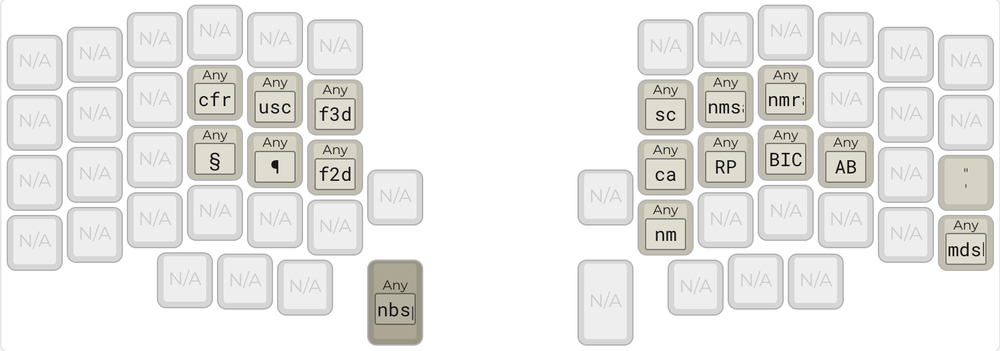

# dizave58

The lily58 was my first alternative keyboard and is still a favorite. I knew right away
however that I was going to want to go a bit smaller. I looked for a layout that worked on
both the lily and the corne and quickly found [miryoku](https://github.com/manna-harbour/miryoku). 

While miryoku is amazing and very well thought out, it leaves many keys unused on the 
lily and even a few unused on the six column corne. After a good deal of thought and 
experimentation I decided to work on a pair of layouts for these two keyboards that were
inspired by miryoku but that made use of the extra keys.

In some ways this is inferior to simply usuing miryoku everywhere, an approach which 
provides the highest level of consistency between keyboards. Nevertheless, I suspect there
are other people like me out there that like miryoku but wouldn't mind being able to use 
the extra keys when they are available. Hopefully this layout can fill that need.

## Design Goals

- Mostly compatible with the miryoku layout while taking
advantage of the extra keys on the lily58 and six-row corne

- Support both QWERTY and COLEMAK

- Switch between windows and mac

- Support unicode characters on windows and mac

- Make better use of the display

## The Layouts

The layouts are basically self-documenting, but here they are:

### Colemak

This is my primary layer, and one of the two default layer choices.
Although I've included shift on the home row, I mainly use it on the 
two main thumb keys. There is no dedicated shift for the pinky fingers.
The QWERTY is the same but, you know, with a QWERTY layout. 

The dizave58 uses home row mods in the GACS configuration (for windows) or CAGS (for mac).
The display shows either a windows or mac symbol to indicate which mode the keyboard is in.
For an amazing overview of home row mods, check out
[precondition's page](https://precondition.github.io/home-row-mods).

Many of the existing lily58 keymaps use the pinky keys and/or the thumb cluster 
for the mod keys. This isn't really an option on the corne, and didn't strike me
as a good use of the thumb cluster on the lily either. So I've mostly avoided doing
that. The outermost thumb keys duplicate, mainly because I couldn't put anything 
important there because then I'd be missing it on the corne. 

### Nav Layer

### Number Layer

Although in general I have tried to keep keys on the opposite side of the 
board from the corresponding layer key, I have made a small departure here.
The parentheses keys are duplicated under the index and middle fingers of the
right hand. I have found this easy and useful in many cases where I am entering
numbers (for example, when entering a phone number with area code).

The number layer also has the ability to configure the keyboard. In the upper
left, the top two keys are used to change the default layer go either QWERTY
(df(0)) or COLEMAK (df(1)).

The lower right switches between windows and mac mode. The current mode is 
displayed in the OLED. Currently all this means is that the GUI and CTRL keys
are switched.

### Legal Layer

OK, so, admittedly this layer is only useful to people who are 
appellate lawyers in New Mexico and rock a corne or a lily. So,
just me. 

I put federal on the left and New Mexico on the right.

The quote gives you a close quote single quote, the kind you use at
the beginning of a shortened patent number that can be such a pain to
enter.

## The Displays

I didn't find the display on the default keymap very useful. Although the
display itself is vertical, the text on it is horizontal. And the information
on the display wasn't particularly useful either, consisting mostly of information
about the most recently typed keys.

On the left display, I have changed the text to be displayed vertically. This
creates an obvious limitation: each line is only five characters. On the other 
hand, there are many more lines to work with.

At the top, it displays what layer is active. This is particularly important since 
the default layer can be either QWERTY or COLEMAK. The other available layers are
the navigation layer and the numbers layer.

The dizave58 uses home row mods in the GACS configuration (for windows) or CAGS (for mac).
The display will show either a windows or mac symbol to indicate which mode the keyboard is in.
This will also (eventually) also indicate which unicode mode is current, windows or mac.

The display also shows the home row mods as either CAGS or GACS. When a modifier is
pressed, that modifier is highlighted in the display.

Finally, the display will show "CAPS" when the caps lock is on.

When the number layer is active, the left display shows the keymap for the main 5x3 keys.
If you hit shift it will show the shifted values.

## Windows and Mac 

There is an adjust key to switch between windows and mac modes.
The keymap decides what mode it is in by looking at whether gui 
and control have been swapped. This setting is stored in the EEPROM
so it is persistent.

The main difference is that the gui and control keys are swapped. This
is shown in the OLED. This makes it pretty painless to switch between
PC and Mac, at least for the tools that I use. But this also allows
the keyboard to send unicode correctly based on the selected OS.

## Misc Features

The large thumb keys are space and backspace, respectively. I had originally used
space and enter, like many other keymaps, but backspace is used much more frequently
so I moved it to the more accessible location.

The large thumb keys operate as shift when held. This has made a huge difference for
me. I can'd believe space isn't shift everywhere, it just works so well.

None of my Lilys have LEDs. (Don't get me started on how the PCBs in the lily58 glow
repository are broken). And, in any event, the MT3 keycaps I am using on them don't 
let the light through anyway. So as much as I enjoy a good light show, I've disabled 
it in this keymap.

# todo

- close key that is cmd Q on mac and alt F4 on windows
- layer with some legal keys: paragragh, section. this requires unicode detect
- get underglow working 
- save default layer to eeprom